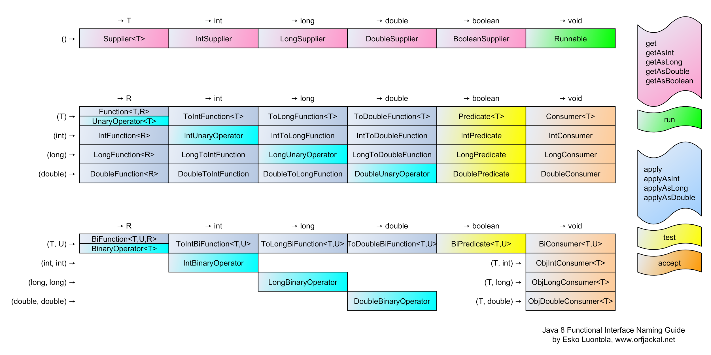

#### *Functional programming in Java*
### **le espressioni lambda**

#### Ezio Sperduto


---

## Ezio Sperduto?
- appassionato di Informatica
- sviluppatore/architetto sw
- laurea/PhD Informatica
- 10+ anni fondatore e guida soc.
- CEO di **turing**
- CodeGardenRoma (XPUG,ben,...)
- 3+ certificazioni Java Oracle
- docente corsi Java (certif. et al.)
- docente ext./corelatore Tesi
---

## CodeGarden?

---

## CodeGarden?
- nasce come Java User Group (JUG Roma)
- comunità tecnologica romana 
- appassionati di Java ma anche altro
- appartenenti al mondo IT
- persone da diverse aziende/mondi
- online: condivisione dubbi, articoli
- offline: incontri periodici
---

## Lambda
Java linguaggio prevalentemente OO

In Java8 aggiunta abilità FP

Non in alternativa ma insieme
---

## Lambda
Object Oriented programming: 

> ogni cosa è un oggetto

Functional programming: 

> ogni cosa è una funzione

Sintesi: **manipolazione** funzioni

---

# sintassi
---

## sintassi


---

## sintassi


parentesi tonde parametro
---

## sintassi


tipo parametro
---

## sintassi
Parentesi tonde parametro
```
a -> ...
(a,b) -> ...
(String a) -> ...
(int x,String y) -> ...
()->...
```
Obbligatorie: 
- se #params ≠ 1
- se c'è qualificatore tipo
---

## sintassi
Parentesi graffe corpo
```
a -> <ESPRESSIONE>
a -> {<BLOCCO_ISTRUZIONI>}
```
Obbligatorie: se usiamo corpo classico
---

## sintassi
Parentesi graffe corpo
```
a -> a * 2 + 3
a -> {int b = a*2; return b+3;}
```
In caso 2: return e ; obbligatori
---

## sintassi

Quali variabili può accedere una lambda?
- campi di classe
- campi d'istanza
- variabili locali *(effectively final)*
- parametri di metodo *(effectively final)*
---

## sintassi
Non è possibile ridefinire i parametri
```
a -> {int a = 3*2; return a+3;}
```
---

## Cosa fa Java sotto?
```
metodoCaller( a -> a+a )
```
equivale a:
```
interface Doppio{
	public abstract int raddoppia(int a);
}

class DoppioConcrete implements Doppio{
	public int raddoppia(int a){
		return a+a;
	}
}

...

Doppio istanza = new DoppioConcrete();
metodoCaller(istanza);

```

---

# Functional Interface
---

## Functional Interface
Definizione:

> una **functional interface** (**fi**)
> è un'interfaccia che ha un solo metodo astratto.

Ogni lambda expression è 

un'implementazione di una **fi**.
---

## Functional Interface
In Java 8, alle interfacce sono stati aggiunti
- metodi **statici**
- metodi di *default*

Dunque facciamo attenzione a riconoscere le **fi**.
---

## Functional Interface
```
interface A{}
interface B{
	default void m1(){}
}
interface C{
	void m2();
}
interface D extends B,C{
	static void m3();
}
interface E extends C{}
interface F extends C{
	default void m3(){}
}
```
---

## Functional Interface
Il tipo di una **fi** è il tipo del suo metodo astratto!
```
interface A{
	int calcola1(int i); 
}
```
tipo: `(int) -> int`
```
interface B{
	String calcola2(double d,char c,short[] sa); 
}
```
tipo: `(double,char,short[]) -> String`
---

## Functional Interface
Per passaggio di lambda a metodo, non occorre conoscere il
nome della **fi** e del metodo astratto:
```java
interface Xxx{
	int yyyy(int i1,int i2); 
}

void metodoChiamante(Xxx lambda){
	...
}

metodoChiamante((a,b)->a+b);
metodoChiamante((c,d)->2*c+d);
metodoChiamante((s,t)->s);
```
---

## Functional Interface
Annotation specifica in `java.lang`

per annotare un'interfaccia funzionale:

**@FunctionalInterface**

ma non è obbligatorio l'uso.
---

## Functional Interface
**EXERCISE!**
```
@FunctionalInterface
interface Magia{
	int calcola(int a,int b,int c);
}

static void caller(Magia m){
	System.out.println("invocato caller!");
}

public static void main(String...aa){
	caller( LAMBDA??? );
}
```
Come possiamo invocare caller?
---

## Functional Interface
**EXERCISE!**
```
@FunctionalInterface
interface Manipolatore<T>{
	T trasforma(int x);
}

static void caller(Manipolatore<String> m){
	System.out.println("invocato caller!");
}

public static void main(String...aa){
	caller( LAMBDA??? );
}
```
Come possiamo invocare caller?
---

## Functional Interface
**EXERCISE!**
```
class Rettangolo{int b,h;}

void applicaFiltro(List<Rettangolo> l,Filtro f){
	for(Rettangolo r:l)
		if(f.verifica(r))
			l.remove(r);
}
```
Come dichiaro `Filtro`?

Come invoco `applicaFiltro`?
---

## Functional Interface
Dove reperire **fi**?
1. costruirle **custom**
2. qualunque **pre-Java8** (*compliant*)
3. built-in in `java.util.function`
---

## Functional Interface
**EXERCISE!**

Interfaccia: **`Runnable`**

Che lambda posso passare?

???
---

## Functional Interface
**EXERCISE!**

Interfaccia: **`Runnable`**

Che lambda posso passare?

`()->{System.out.println("ciao");}`
---

## Functional Interface
**EXERCISE!**

Interfaccia: **`Comparator<Rettangolo>`**

Che lambda posso passare?

???
---

## Functional Interface
**EXERCISE!**

Interfaccia: **`Comparator<Rettangolo>`**

Che lambda posso passare?

`(r1,r2) -> r2.b - r1.b`
---

## Functional Interface
**EXERCISE!**

Interfaccia: **`ActionListener`**

Che lambda posso passare?

???
---

## Functional Interface
**EXERCISE!**

Interfaccia: **`ActionListener`**

Che lambda posso passare?

`e->{JOptionPane.showMess...}`
---

## fi Built-in 
Package: `java.util.function`

nome | input | output 
----|:----:|:----:
`Predicate<T>` | T | boolean 
`Function<T,R>` | T | R 
`Supplier<T>` | void | T 
`Consumer<T>` | T | void 
`BiFunction<T,U,R>` | T,U | R 
---

## fi Built-in 
Conoscendo il tipo,

è possibile avere una referenza alla **lambda**:
```
Function<String,Integer> lunghezza = s -> s.length();
```
ed è possibile passarla ad un metodo:
```
void caller(Function<String,Integer> funzione){...}

caller(lunghezza);
```
---

## fi Built-in 
Metodi all'interno delle **fi**
- `Predicate.test(...)`
- `Function.apply(...)`
- `Supplier.get()`
- `Consumer.accept(...)`
- `BiFunction.apply(...)`
---

## Predicate
```
Predicate<Integer> maggioriCento = i -> i>100;
Predicate<Integer> negativi = i -> i<0;

List<Integer> filtraConPred(List<Integer> l,Predicate<Integer> p){
	List<Integer> res=new ArrayList<>();
	for(Integer i:l)
		if(p.test(i))
			res.add(i);
	return res;
}
...
List<Integer> l = Arrays.asList(2,-1,120,130,-99,60);
filtraConPred(l,maggioriCento);
filtraConPred(l,negativi);
```
Output: 120,130 e -1,-99
---

## Predicate
**EXERCISE!**
1. Costruire un predicato filtro che restituisca i numeri pari.
2. Costruire un metodo che prenda un `Set` e un predicato e restituisca una coppia (magari array da 2) di `Set` con i valori ripartiti tra quelli con predicato vero e quelli con predicato falso. 
---

## Predicate
Alle vecchie API sono state aggiunte nuove
funzionalità sfruttando le nuove **fi** built-in, esempio: 
```
Predicate<String> p = s -> s == null;

List<String> lista = Arrays.asList("aaa","","b","","cccc",null);

lista.removeIf(p);
lista.removeIf(s -> s.isEmpty());
```
---

## Function
Esempio:
```
Function<String,String> f= s->s.substring(0,2);
```
---

## Function
**EXERCISE!**

Costruire una funzione che prende e restituisce una stringa:
1. senza spazi iniziali e finali
2. minuscola
3. senza vocali
---

## Supplier e Consumer
Esempi:
```
Supplier<Integer> genera10 = () -> ((int)(Math.random()*10)) + 1;
```
e
```
Consumer<Object> cons = o -> {registro.put(o.toString(),o)};
```
---

## fi Built-in 

---

## Method reference
Riferimento a metodi pre-esistenti in classi

### Operatore : :
```
class Rettangolo{
	...
	int area(){...}
}

Rettangolo r=new Rettangolo();
caller(r::area);
```
---

## Method reference
Riferimento a metodi pre-esistenti in classi

Dichiarazione di caller:
```
void caller(Supplier<Integer> supp){
	...
	int valore = supp.get();
	...
}
```
---

## Method reference
E' possibile usare la *method reference* in 4 casi differenti:
1. metodi statici
2. metodi d'istanza (su un'istanza specifica)
3. motodi d'istanza (su un'istanza a runtime)
4. costruttori
---

## Method reference
Metodi statici
```
class Rettangolo{
	static void calcola(int a,int b){...}
}

caller(Rettangolo::calcola);
```
---

## Method reference
Metodi d'istanza (su un'istanza specifica)
```
class Rettangolo{
	...
	int area(){...}
}

Rettangolo r=new Rettangolo();
caller(r::area);		// che firma?
```
---

## Method reference
Metodi d'istanza (su un'istanza a runtime)
```
class Rettangolo{
	...
	int area(){...}
}

caller(Rettangolo::area);  // che firma?
```
---

## Method reference
Costruttori
```
class Rettangolo{
	...
	Rettangolo(){...}
	Rettangolo(int a,int b){...}
}

caller(Rettangolo::new);  // che firma?
```
---

## Method reference
**EXERCISE!**

Metodo aggiunto a `List`:
```
default void forEach(Consumer action){...}
```
il metodo scorre e applica `action` ad ogni elemento.
```
List<Integer> lista = Arrays.asList(3,5,6,3,2);
lista.forEach( ??? );
```
Cosa passare per stampare ogni elemento?
---

## BiFunction
**EXERCISE!**

Costruire una funzione **comp** binaria che prende due funzioni, e restituisca una funzione che rappresenti la **composizione** delle due!!!

*Esempio: comp(f,g) = g(f(x))*
---

# Domande?

##### grazie per l'attenzione

